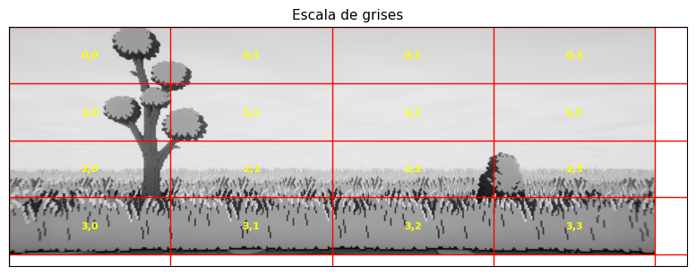
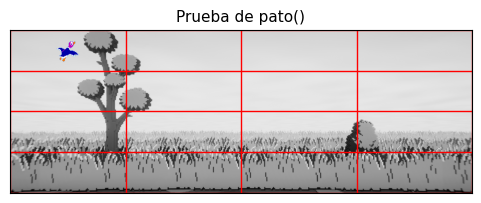
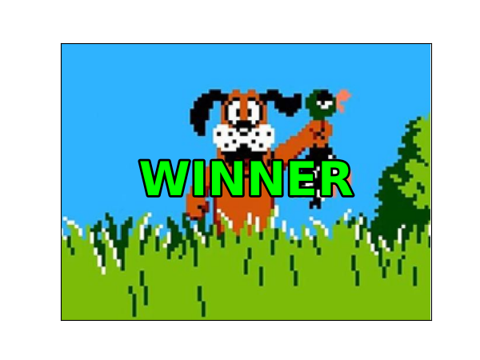
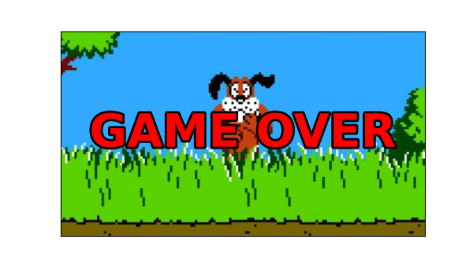
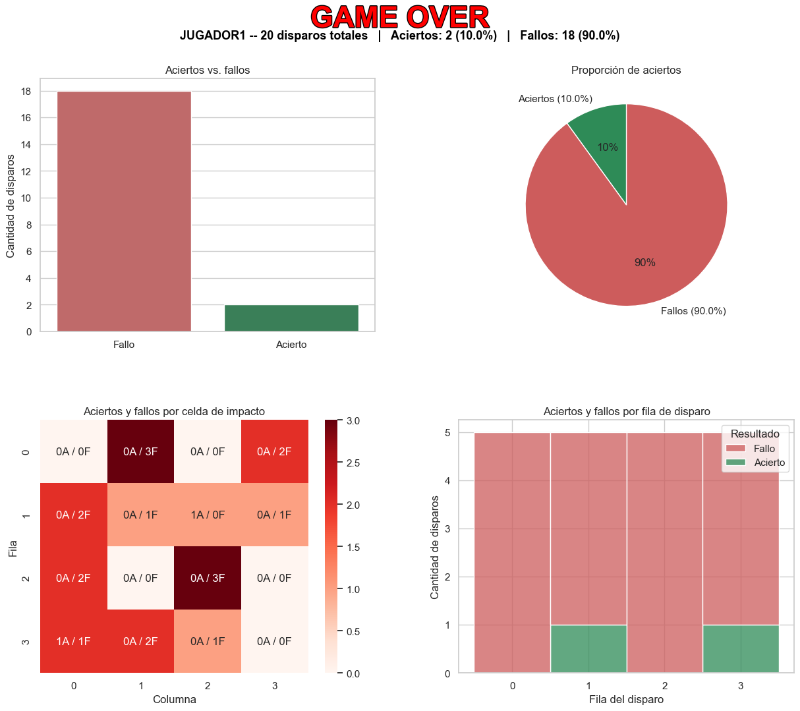
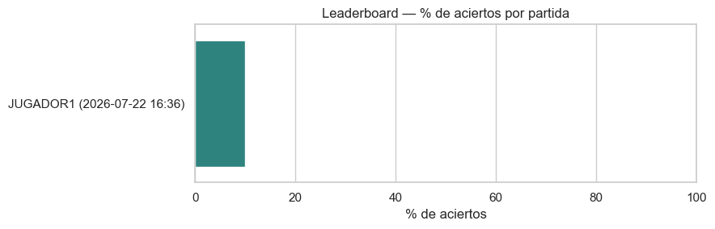
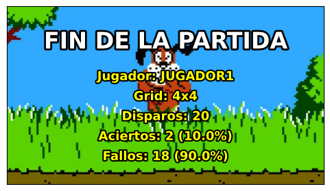

\begin{titlepage}
\centering

\vspace*{0.5cm}
{\Large \textbf{UNIVERSIDAD DE INGENIERÍA Y TECNOLOGÍA}}

\vspace{0.3cm}
{\large ESCUELA DE POSGRADO}

\vspace{1.2cm}
\includegraphics[height=2.8cm]{docs/utec_logo.png}

\vspace{1.8cm}
{\LARGE \textbf{SIMULACIÓN DEL JUEGO DUCK HUNT}}

\vspace{0.4cm}
{\Large Informe técnico}

\vspace{1.5cm}
\textbf{AUTOR(ES)}

\vspace{0.2cm}
\textit{[Nombres y apellidos del equipo -- completar antes de entregar]}

\vspace{1cm}
\textbf{DOCENTE}

\vspace{0.2cm}
Royer Rojas Malasquez

\vspace{1cm}
\textbf{CURSO}

\vspace{0.2cm}
Programación 101

\vspace{1.5cm}
Lima -- Perú

2026

\end{titlepage}

\tableofcontents
\newpage

# PRESENTACIÓN DEL CASO

Para el curso de Programación 101 armamos una simulación del videojuego Duck Hunt en Python. La idea es simple: aparece un pato en una celda al azar de una cuadrícula, se dispara a otra celda al azar, y el programa revisa si coinciden. Esto se repite un número de veces configurable y, al terminar, se arma un resumen estadístico de toda la partida.

Todo el proyecto vive en un solo notebook, `DuckHunt_Simulacion.ipynb`, dividido en 9 secciones que se corren de arriba hacia abajo. Usa las cuatro librerías que pide el curso —NumPy, pandas, Matplotlib y Seaborn— más Pillow para cargar las imágenes.

# DEFINICIÓN DEL PROBLEMA CENTRAL

El enunciado del profesor Rojas Malasquez pide construir una aplicación que aplique programación estructurada, funciones, manejo de matrices e imágenes, números aleatorios y estadística básica. En concreto exige:

- Un fondo dividido en una cuadrícula `n×n`, mostrado en blanco y negro o escala de grises.
- Una función `pato()` que elija una celda al azar (con NumPy) y dibuje el pato ahí.
- Una función `pistola()` que elija una celda de impacto al azar.
- Comparar ambas posiciones y mostrar la imagen correspondiente: el perro con el pato si hubo acierto, o burlándose si no.
- Un número de disparos configurable, con 20 como valor por defecto.
- Una pantalla final con las estadísticas del juego (total, aciertos, fallos, porcentajes).
- Gráficos estadísticos (barras, histograma, pie chart, heatmap) hechos con pandas, Matplotlib y Seaborn.

El problema no es solo armar un juego que funcione, sino demostrar el manejo de esas herramientas puntuales en cada parte del código, con buenas prácticas de por medio (funciones separadas, validaciones, comentarios).

# ANÁLISIS DEL CASO

## Cómo está armado el notebook

| Sección | Qué hace |
|---|---|
| 1. Configuración inicial | Importa las librerías, define las rutas a `assets/`, valida que existan. |
| 2. Configuración de la partida | Pide por teclado el nombre, el número de disparos y el tamaño del grid; valida los tres valores. |
| 3. Carga y preprocesamiento del fondo | Carga la imagen y la convierte a escala de grises; arma la cuadrícula. |
| 4. Función `pato()` | Elige una celda al azar y dibuja el sprite ahí. |
| 5. Función `pistola()` | Elige una celda de impacto al azar y dibuja una mira. |
| 6. Validación de impacto | Compara las dos posiciones y muestra la imagen de acierto o fallo. |
| 7. Bucle principal | Repite el ciclo completo `N` veces. |
| 8. Resultados y CSV | Arma la tabla de la partida, calcula el resumen, lo guarda en un historial. |
| 9. Visualización estadística | Genera los 4 gráficos y compara contra el historial de partidas. |

## El fondo y la cuadrícula

El enunciado pide mostrar el fondo en blanco y negro o en escala de grises, así que decidimos usar solo escala de grises en todo el proyecto: no hay ninguna versión a color del tablero mientras se juega. La conversión se hace con la fórmula de luminosidad de siempre,

```
gris = 0.299·R + 0.587·G + 0.114·B
```

aplicada de una sola vez a toda la imagen con `np.dot(imagen[..., :3], [0.299, 0.587, 0.114])`, sin recorrer píxel por píxel.

Para dividir el tablero en celdas calculamos los bordes de cada fila y columna con `np.linspace`. Con un fondo de 1920 px de ancho y un grid de 4 columnas, por ejemplo, los bordes quedan en `[0, 480, 960, 1440, 1920]`: cuatro columnas de 480 px cada una. Ese mismo arreglo de bordes es lo que después usan `pato()` y `pistola()` para saber dónde cae cada celda.



## `pato()` y `pistola()`

Las dos funciones eligen una celda con `np.random.randint` y dibujan algo ahí. Para el pato usamos `ax.imshow(sprite, extent=[...])`: Matplotlib mezcla la transparencia del PNG solo, así que no hizo falta escribir una fórmula de composición alfa a mano (la primera versión sí lo hacía así, y era bastante más código del necesario). Para la mira de la pistola usamos un `Rectangle` y un marcador `"x"`, ambos ya construidos en Matplotlib.

Nos topamos con un problema real en el camino: `pato.png` no tenía transparencia de verdad, tenía un fondo celeste sólido pintado como parte de la imagen (`np.unique(arr[...,3])` daba solo `255` en todo el archivo). Lo resolvimos una sola vez, fuera del notebook: generamos una versión limpia del sprite (`pato_limpio.png`) quitando ese fondo con chroma-key, y el notebook ya carga directamente esa versión — así el código de `pato()` no tiene que lidiar con eso cada vez que se ejecuta.



## Validación de impacto

`procesar_disparo()` compara la posición del pato contra la del disparo con un simple `==` entre tuplas, y arma un diccionario con el resultado. Si coinciden se muestra `ganador.jpeg` (el perro con el pato); si no, `gameover.jpg` (el perro burlándose). Ninguna de las dos lleva texto encima — la imagen ya dice lo que pasó.

{width=55%}

{width=55%}

El juego siempre completa los `N` disparos configurados; no se corta en el primer fallo, porque las estadísticas finales necesitan la mayor cantidad de datos posible.

## Resultados y estadísticas

Con la lista de resultados armamos una tabla de pandas y calculamos el resumen (total, aciertos, fallos, porcentajes). Ese resumen se guarda además en un CSV que se va acumulando entre partidas —cada vez que alguien corre el notebook, se agrega una fila nueva sin borrar las anteriores.

Para el cierre generamos los 4 gráficos que pide el enunciado. Jugamos una partida de ejemplo con la configuración por defecto (grid `4×4`, 20 disparos) y el resultado fue **2 aciertos de 20 (10%)**. Tiene sentido: con 16 celdas y una posición de disparo totalmente independiente de la del pato, la probabilidad de acertar cada disparo por azar es de `1/16`, más o menos 6.25%, así que sobre 20 intentos lo esperable es acertar 1 o 2 veces. El juego, en el fondo, no mide puntería —mide qué tan seguido coinciden dos números aleatorios— y cada partida termina siendo un experimento de probabilidad con pocas repeticiones.



El gráfico de barras y el pie chart muestran lo mismo desde dos ángulos: aciertos contra fallos. El heatmap es el que más cambió respecto a una versión anterior del proyecto: antes solo contaba en qué celdas aparecía el pato, y ahora muestra, celda por celda, cuántos disparos cayeron ahí y si fueron acierto o fallo (anotado como `"A / F"`) — el resultado del juego, no solo dónde eligió aparecer `pato()`. El histograma cuenta lo mismo pero por fila, con aciertos y fallos apilados en la misma barra.

Como la partida quedó guardada en el CSV histórico, también se arma un leaderboard comparando todas las partidas jugadas hasta el momento.



# ALTERNATIVAS DE SOLUCIÓN

Varias partes del proyecto pasaron por más de una versión antes de quedar como están ahora.

**Configuración de la partida.** La primera versión tenía una pantalla estilo consola retro con botones (`ipywidgets`) para elegir nombre, disparos y grid. Se veía bien, pero depende de que el entorno donde se abre el notebook tenga el renderizador de widgets funcionando — si no, los botones quedan ahí sin responder. Terminamos usando `input()` simple: menos vistoso, pero funciona igual en cualquier notebook sin depender de nada extra.

**Transparencia del pato.** Como se explicó arriba, el sprite no tenía canal alfa real. La alternativa habría sido detectar y quitar el fondo celeste en cada ejecución del notebook (chroma-key en vivo); en cambio se hizo una sola vez y se guardó el resultado como un archivo aparte, para no meter esa lógica en el código que se explica en clase.

**Cómo mostrar el fondo.** Al principio mostrábamos el tablero en tres versiones — color, escala de grises y blanco/negro — una al lado de la otra. El enunciado solo pide blanco/negro *o* escala de grises, así que tener las tres no sumaba nada al juego, solo código de más. Nos quedamos con escala de grises únicamente.

**Los gráficos finales, con o sin fondo.** Probamos dibujar el panel de 4 gráficos directamente sobre la imagen de `gameover.jpg`, con "GAME OVER" como título, para que el cierre de la partida y las estadísticas quedaran en una sola pantalla. De lejos se veía bien, pero de cerca los gráficos —sobre todo el heatmap, que tiene texto en cada celda— se volvían difíciles de leer con la foto de fondo compitiendo por la atención. Terminamos sacando la foto y dejando el título "GAME OVER" en texto plano, con los gráficos sobre fondo blanco debajo.

**Sonido y splash de sangre.** En un momento del desarrollo agregamos un splash de sangre (manchas rojas generadas con NumPy sobre el pato) y sonido sintetizado para aciertos y fallos. Se sacaron después: complicaban la explicación sin sumar mucho, ya que las imágenes de `ganador.jpeg` y `gameover.jpg` alcanzan para comunicar el resultado.

**Límite del tamaño del grid.** El grid tenía un tope de 8×8 sin ninguna razón técnica real detrás. Como `pato()` calcula el tamaño del sprite en función del tamaño de la celda (`extent_celda()`), el pato nunca se sale de su celda sin importar qué tan chica sea. Se subió el límite a 100×100 — un grid más fino baja la probabilidad de acierto por azar y se parece más a apuntar con precisión de verdad.

# RECOMENDACIÓN FINAL

La versión final del notebook resuelve el caso con lo mínimo necesario para cumplir el enunciado, sin agregar cosas que compliquen la explicación en la exposición: escala de grises únicamente, configuración por `input()`, `pato()`/`pistola()` apoyándose en lo que Matplotlib ya resuelve solo (transparencia automática, formas geométricas listas), y estadísticas con los 4 tipos de gráfico que pide el curso, sin depender de una imagen de fondo que compita con los datos.

Esa combinación es la que mejor equilibra dos cosas que el enunciado pide a la vez: cumplir con el uso de las librerías obligatorias, y mantener "calidad del código" y "buenas prácticas" — que también son parte de la nota.

# PLAN DE IMPLEMENTACIÓN

Como el proyecto es un notebook, lo importante es no separarlo de la carpeta `assets/`: el código carga las imágenes con rutas relativas (`assets/pato_limpio.png`, `assets/gameover.jpg`, etc.), así que esa carpeta tiene que estar en el mismo directorio que el notebook. `verificar_assets()` (Sección 1) revisa esto apenas se corre la primera celda y avisa con un mensaje claro si falta algo.

**Localmente (Jupyter / VS Code):** clonar el repositorio completo, no alcanza con descargar solo el `.ipynb`.

```bash
git clone https://github.com/GoDeeper96/duckHuntProyectoMaestria.git
cd duckHuntProyectoMaestria
pip install -r requirements.txt
jupyter notebook DuckHunt_Simulacion.ipynb
```

**Google Colab (o cualquier entorno sin el repo clonado):** subir el notebook y, además, subir la carpeta `assets/` completa (con sus 4 imágenes) al mismo espacio de trabajo, manteniendo el nombre `assets/`.

Una vez que el notebook y la carpeta están juntos, se corre celda por celda de arriba hacia abajo. La Sección 2 pide el nombre, el número de disparos (5-100) y el tamaño del grid (3-100) por teclado. La Sección 7 (bucle principal) tarda unos segundos porque genera dos figuras por disparo.

# CONCLUSIONES

El notebook cumple los cuatro pilares del curso: NumPy para matrices, cuadrículas y aleatoriedad; pandas para el registro y las estadísticas; Matplotlib para todo el dibujo del tablero y las pantallas; Seaborn para los gráficos de cierre. El código está separado en funciones chicas, cada una con una responsabilidad puntual, y con comentarios explicando el porqué de las decisiones, no solo el qué hace cada línea.

Más allá de cumplir la consigna, ir y volver sobre varias decisiones —las que se listan en "Alternativas de solución"— sirvió para confirmar algo bastante práctico: la primera versión que funciona no siempre es la más fácil de explicar, y vale la pena revisar el código con esa pregunta en mente antes de darlo por terminado.

# REFERENCIAS

- Rojas Malasquez, Royer. *Simulación del Juego Duck Hunt usando Python y Librerías de Ciencia de Datos* — Enunciado de proyecto de curso, Programación 101, UTEC.
- Repositorio del proyecto: [github.com/GoDeeper96/duckHuntProyectoMaestria](https://github.com/GoDeeper96/duckHuntProyectoMaestria)
- Documentación de NumPy, pandas, Matplotlib y Seaborn (sitios oficiales de cada librería).

# ANEXOS

## Explicación de las librerías utilizadas

El detalle completo de por qué se usó cada librería, con ejemplos tomados del código, está en un documento aparte: [`LIBRERIAS.md`](./LIBRERIAS.md). Como resumen:

| Librería | Rol en el proyecto |
|---|---|
| NumPy | Matrices, cuadrículas, conversión a grises, aleatoriedad |
| pandas | Registro de disparos, resumen estadístico, CSV histórico |
| Matplotlib | Todo el dibujo: tablero, sprites, texto, pantallas |
| Seaborn | Gráfico de barras, pie chart, heatmap e histograma |
| Pillow | Carga de imágenes desde disco |

## Capturas adicionales

{width=70%}
