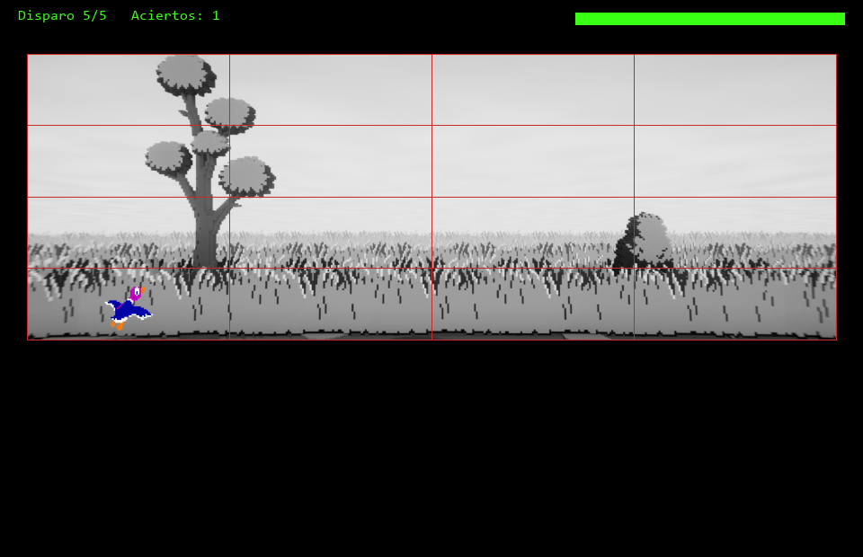
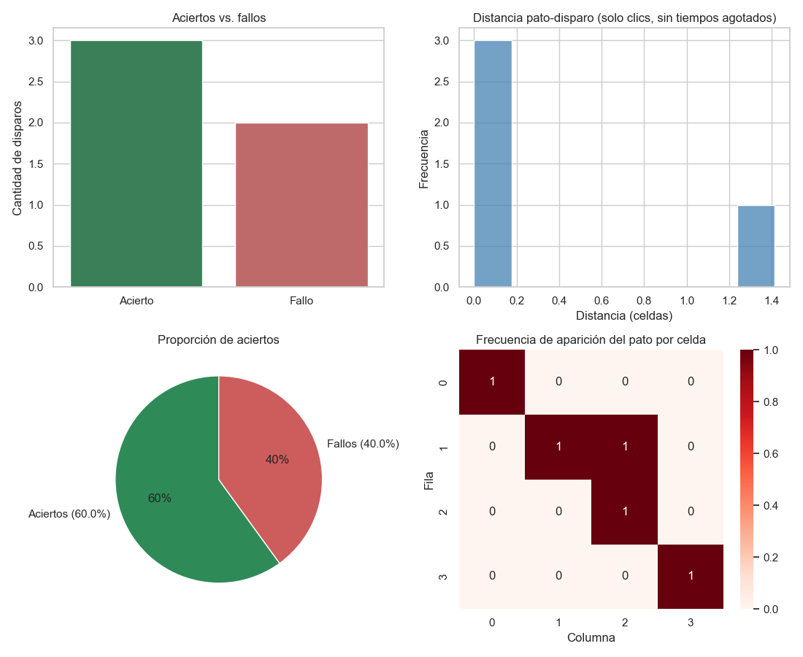

# 🦆 Duck Hunt — Simulación en Python

Proyecto de curso de **Programación 101** — Maestría en Ciencia de Datos e Inteligencia Artificial, UTEC. Profesor: **Royer Rojas Malasquez**.

Hay dos entregables independientes:

1. **[`DuckHunt_Simulacion.ipynb`](./DuckHunt_Simulacion.ipynb)** — la simulación que pide el enunciado: `pato()` y `pistola()` generan sus posiciones al azar (NumPy), y el proyecto se evalúa sobre esto (NumPy, pandas, Matplotlib, Seaborn son obligatorias aquí).
2. **[`juego_jugable/`](./juego_jugable/)** — un extra: la misma idea, pero jugable de verdad con pygame (el jugador hace clic para disparar, con temporizador).

<p align="center">
  
</p>

## 1. El notebook (entregable principal)

- Configuración de partida con **3 `input()` validados** (nombre, número de disparos, tamaño de grid): cada uno se vuelve a pedir hasta que el valor sea válido, así que siempre se puede cambiar el número de disparos (ej. 30, 40) o el tamaño del grid — no dependen de que ningún widget se renderice bien en tu entorno.
- Tablero dividido dinámicamente en una cuadrícula `n x n`. El enunciado pide mostrar el fondo en blanco/negro o escala de grises (no menciona color), así que **el tablero donde realmente se juega usa la versión en grises** (fórmula de luminosidad calculada a mano con NumPy); el color solo aparece como comparación en la Sección 3.
- `pato()`: aparece en una celda aleatoria (NumPy), con el fondo celeste de su sprite removido por **chroma-key** y pegado sobre el tablero con **mezcla alfa**.
- `pistola()`: dispara a una celda aleatoria y dibuja una mira vectorial (círculo + cruz) con Matplotlib.
- Validación de impacto: si pato y disparo coinciden → splash de sangre + pantalla **WINNER** + tono agudo sintetizado; si no → pantalla **GAME OVER** + tono grave.
- Bucle principal: juega los `N` disparos configurados completos (no se corta en el primer fallo).
- Pantalla final con el resumen de la partida, y registro en un **CSV histórico** (`registros_jugadores.csv`) que acumula todas las partidas de todos los jugadores.
- Estadísticas finales con pandas + Matplotlib + Seaborn: gráfico de barras, histograma, pie chart, heatmap de posiciones del pato, y un *leaderboard* comparando jugadores.

<p align="center">
  
</p>
<p align="center">
   &nbsp;
  
</p>
<p align="center">
  
</p>

### Librerías usadas en el notebook

| Librería | Para qué se usa aquí |
|---|---|
| **NumPy** | Posiciones aleatorias, matrices del tablero, conversión a grises/B-N, chroma-key, mezcla alfa, splash de sangre, síntesis de audio |
| **pandas** | Registro de cada disparo, resumen estadístico, CSV histórico, leaderboard |
| **Matplotlib** | Dibujo del tablero, la mira, las pantallas de reacción y los gráficos |
| **Seaborn** | Gráfico de barras, histograma y heatmap de la Sección 9 |
| **Pillow (PIL)** | Carga, recorte y redimensionado de imágenes/sprites |

### Cómo ejecutar el notebook

```bash
pip install -r requirements.txt
jupyter notebook DuckHunt_Simulacion.ipynb
```

1. Corre las celdas **en orden, de arriba hacia abajo**.
2. En la **Sección 2** aparecen 3 preguntas en el cuadro de texto: nombre (solo letras), número de disparos (5-99, Enter = 20) y tamaño de grid (3-8, Enter = 4). Si escribes algo inválido, te lo vuelve a pedir. Las celdas siguientes dependen de esta configuración.
3. La **Sección 7** (bucle principal) genera varias figuras y un sonido por cada disparo — con 20 disparos por defecto, tarda unos segundos en terminar.
4. Al final (secciones 8 y 9) se muestra la pantalla de resultados, se guarda la partida en `registros_jugadores.csv`, y se generan los gráficos estadísticos.

### Notas de diseño del notebook

- **`pato (1).png` no tenía transparencia real** — tenía un fondo celeste sólido "horneado" en el archivo. Se detectó inspeccionando el canal alfa con NumPy y se resolvió con una función de *chroma-key*.
- El **splash de sangre** y la **mira del disparo** se generan por código (círculos con NumPy), no son imágenes — mismo criterio de "manipulación de imágenes" con fórmulas explícitas en vez de funciones de conveniencia de una librería.
- El **audio** (aciertos/fallos) se sintetiza con ondas senoidales de NumPy (`IPython.display.Audio`), porque no había archivos de sonido en el proyecto.

## 2. El modo jugable (`juego_jugable/`, extra)

El enunciado dice que tanto `pato()` como `pistola()` generan su posición **al azar** — no hay clic del jugador en ningún lado; es una simulación estadística, no un juego de puntería. El modo jugable es un extra fuera de lo evaluado: la misma idea, pero con pygame el jugador sí apunta y hace clic de verdad, con un temporizador por ronda.

<p align="center">
  
</p>

### Por qué cada pieza es como es

| Decisión | Opciones consideradas | Por qué esta |
|---|---|---|
| **Motor de la partida** | pygame vs. Tkinter vs. ambos | **pygame** para todo el juego en tiempo real (temporizador, clics, animación). Tkinter no maneja bien un game loop; se reserva para la ventana de resultados al final. |
| **Colisión clic → pato** | por celda / bounding box / píxel-perfecto (alfa) | **Por celda**: convertimos el clic a índice de celda con la misma matemática de `bordes_fila/bordes_columna` del notebook, y comparamos índices. Consistente con el resto del proyecto (todo es "a nivel de celda"), y fácil de auditar. |
| **Comportamiento del pato** | aparece fijo con tiempo límite / vuela en tiempo real | **Aparece fijo, con 1.5s para reaccionar**: más simple de razonar y de explicar que animar una trayectoria con delta-time; el reto es la velocidad de reacción, no la puntería sobre un blanco móvil. |
| **Organización del código** | un solo script / varios módulos | **Varios módulos**, cada uno con una responsabilidad (ver tabla de archivos abajo) — más fácil de explicar y de testear por separado. |
| **CSV de resultados** | mismo archivo que el notebook / uno separado | **Separado** (`registros_jugadores_interactivo.csv`): mide una habilidad distinta (reacción/puntería real) de la simulación puramente aleatoria del notebook; mezclarlos en el mismo leaderboard compararía cosas no comparables. |

### Estructura de `juego_jugable/`

```
juego_jugable/
├── main.py                — orquesta todo: máquina de estados CONFIG -> JUGANDO -> FIN
├── constantes.py           — rutas, colores, límites de configuración
├── logica.py                — funciones puras (sin pygame): grises/BN, chroma-key,
│                               grid, aleatoriedad, síntesis de tono, estadísticas
│                               (mismas fórmulas que el notebook, reimplementadas
│                               porque un .ipynb no se puede importar como módulo)
├── configuracion_nes.py    — pantalla de configuración con flechas del teclado dentro
│                               de la ventana de pygame (el notebook usa input() en vez
│                               de esto, porque un notebook no tiene un game loop propio)
├── tablero.py                — fondo en escala de grises + grid; convierte coordenadas
│                               pantalla <-> celda (el tablero se dibuja escalado)
├── partida.py                — la "Ronda": máquina de estados de 2 pasos
│                               (ESPERANDO_CLIC -> RESUELTA), con reloj inyectable
│                               para poder testear el timeout sin esperar 1.5s reales
├── render_juego.py         — sprites con alfa (pygame.image.frombuffer), splash, HUD
├── audio.py                  — mismo generar_tono() del notebook, reproducido con
│                               pygame.mixer en vez de IPython.display.Audio
├── resultados_tkinter.py — ventana nativa de resumen al cerrar el juego
└── graficos.py                — mismos 4 gráficos del notebook (barras, histograma,
                                pie, heatmap) + leaderboard, sobre el CSV separado
```

<p align="center">
  
</p>

### Cómo ejecutar el modo jugable

```bash
pip install -r requirements.txt
cd juego_jugable
python main.py
```

1. En la pantalla NES, usa las flechas del teclado (↑↓ cambian el valor, ←→ mueven el cursor) y **ENTER** para confirmar.
2. Cuando aparece el pato, haz clic dentro de su celda antes de que se acabe la barra de tiempo (arriba a la derecha).
3. Al completar los disparos configurados, se cierra la ventana del juego y se abre una ventana de resultados; al cerrarla, se guarda la partida en el CSV y se muestran los gráficos finales.

## Pendiente para el equipo

Del enunciado original, esto todavía no está cubierto:

- [ ] Informe técnico en PDF
- [ ] Capturas de ejecución adicionales para el informe
- [ ] Exposición en clase
- [ ] Video corto de demostración (opcional)
